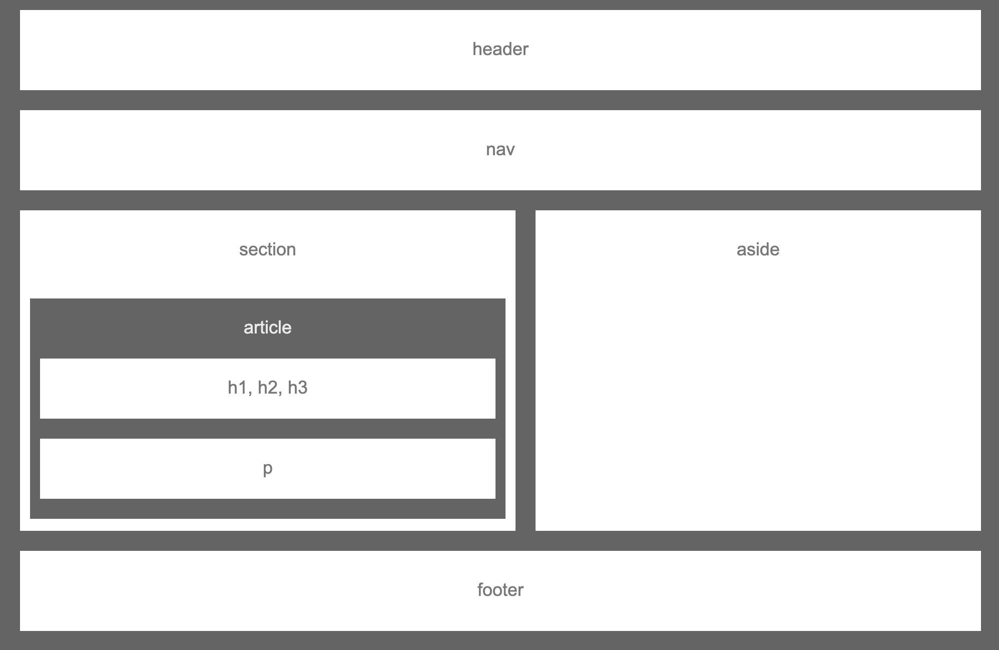

# HW-Wireframe
Homework 1

## Description:
This is a wireframe or skeleton that indicates specific elements of a web application.

## Technologies Used: 
* HTML 
* CSS

## Concepts Learned: 
* Using basic HTML tags
* Styling and positioning using CSS 

## Authors: 
* Megha Bindiganavale 
